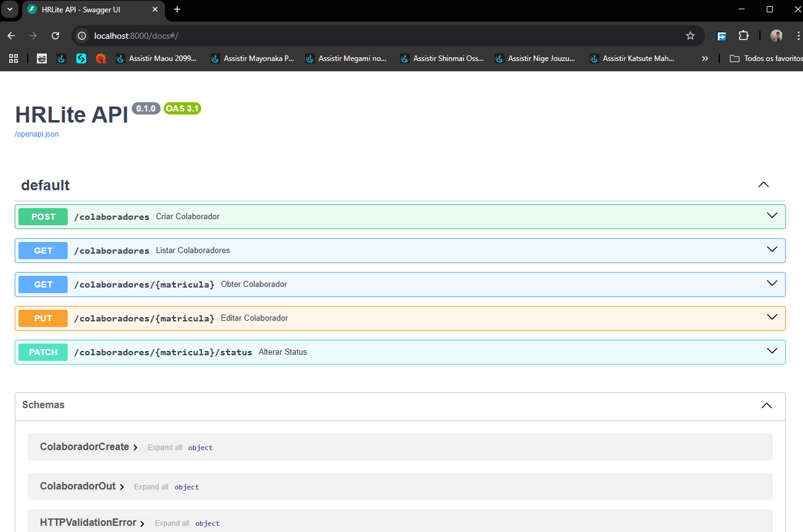

# HRLite

A lightweight Human Resources management API built with FastAPI and SQLAlchemy.

## Features

- Register new employees (collaborators)
- List, filter, and order collaborators by name, CPF, or registration number
- Search by status (Active/Inactive)
- Edit collaborator data
- Change collaborator status (Active/Inactive)
- RESTful API ready for frontend integration

## Technologies

- Python 3.12+
- FastAPI
- SQLAlchemy
- SQLite (default, easy to switch to PostgreSQL)
- Pydantic

## How to Run Locally

1. **Clone the repository:**
   ```bash
   git clone https://github.com/yourusername/hrlite.git
   cd hrlite/Backend
   ```

2. **Install dependencies:**
   ```bash
   pip install -r requirements.txt
   ```

3. **Start the API:**
   ```bash
   uvicorn main:app --reload
   ```

4. **Access the documentation:**
   - Open [http://localhost:8000/docs](http://localhost:8000/docs) in your browser.

## API Endpoints

- `POST /colaboradores` — Create a new collaborator
- `GET /colaboradores` — List collaborators (with filters and ordering)
- `GET /colaboradores/{matricula}` — Get a collaborator by registration number
- `PUT /colaboradores/{matricula}` — Edit a collaborator
- `PATCH /colaboradores/{matricula}/status` — Change collaborator status

## Screenshots

| Swagger UI | API ON |
|--------------------|------------------|
|  |  |


## Deployment

- Ready for deployment on [Render](https://render.com/) or similar platforms.
- For production, configure your database URL in the environment variables.

## License

MIT License

---

**Feel free to contribute or open issues!**